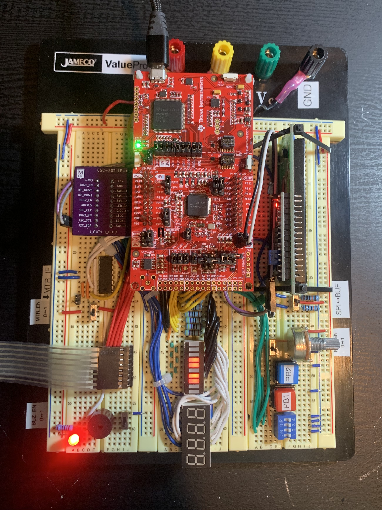

# MCC CSC202 — LP-MSPM0G3507 Breakout Boards

KiCad project files and fabrication outputs for **breakout boards based on the TI MSPM0G3507 LaunchPad footprint** designed to fit dual- and triple-breadboard platforms (e.g., Jameco ValuePro) for use in Monroe Community College’s CSC-202 course.

---

## ℹ️  Hardware Documentation (MkDocs)

- **[Live Docs Site (renders + PDFs + iBOM + fabrication zips](https://thundersloth.github.io/mcc-csc202-lp-mspm0g3507-breakouts/)**  


---

## 📁 Boards

### **2-Term Breakout**
- [Docs Page](https://thundersloth.github.io/mcc-csc202-lp-mspm0g3507-breakouts/2-term/)
- [Download Gerbers (ZIP)](https://thundersloth.github.io/mcc-csc202-lp-mspm0g3507-breakouts/artifacts/2-term/fab/CSC202_LP_MSPM0G3507_2TERM_BREAKOUT_fab.zip)


---

### **3-Term Breakout**
- [Docs Page](https://thundersloth.github.io/mcc-csc202-lp-mspm0g3507-breakouts/3-term/)
- [Download Gerbers (ZIP)](https://thundersloth.github.io/mcc-csc202-lp-mspm0g3507-breakouts/artifacts/3-term/fab/CSC202_LP_MSPM0G3507_3TERM_BREAKOUT_fab.zip)


---

## 🛠 Repo Layout

- `hardware/pcb/kicad/` → KiCad source projects (per-board)
- `hardware/kibot/` → KiBot config
- `outputs/` → local generated artifacts (ignored/regen as needed)
- `docs/` + `docs/artifacts/` → MkDocs site + published artifacts

---

## 🔄 Generating outputs locally

If you want to regenerate all artifacts with KiBot + sync them into MkDocs:

```bash
make
```

---

## 📸 Fabricated Board Photo

The photo below shows the **3-Term breakout installed on a breadboard** after fabrication.

<p align="center">
  
</p>

