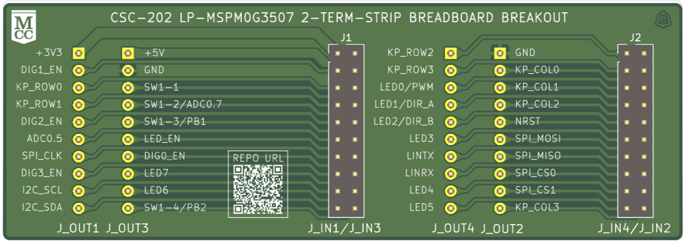
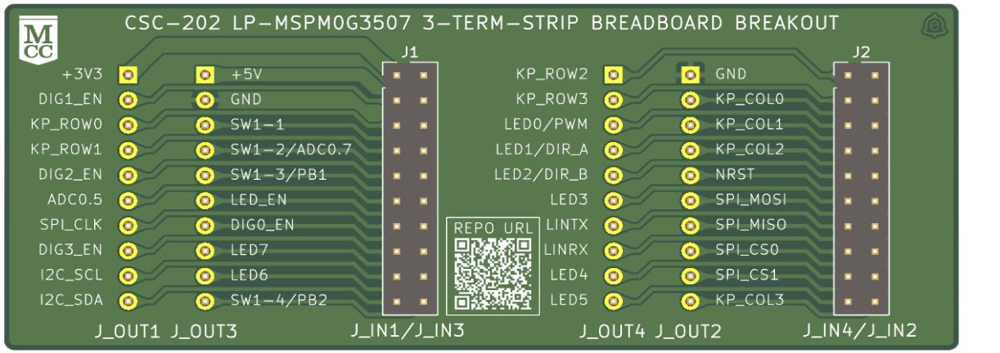

# mcc-csc202-lp-mspm0g3507-breakouts
KiCad project files and Gerbers for breakout boards of the TI MSPM0G3507 microcontroller, designed to fit dual- and triple-breadboard platforms (e.g., Jameco ValuePro) for use in Monroe Community College’s CSC-202 course.

**2-Terminal Version (100×35 mm)**

**3-Terminal Version (90×35 mm)**

