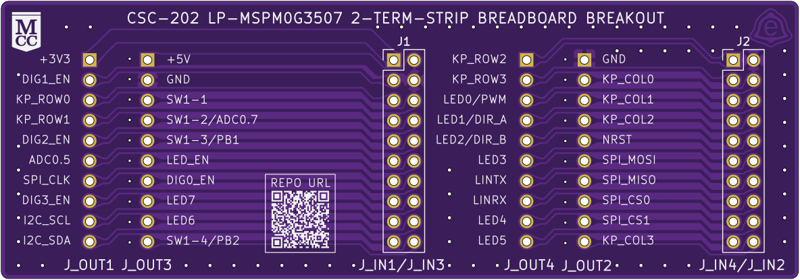
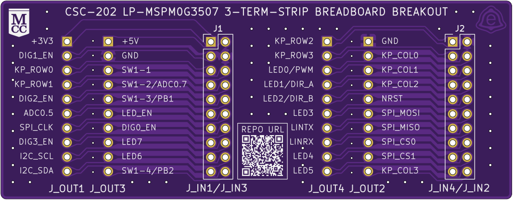
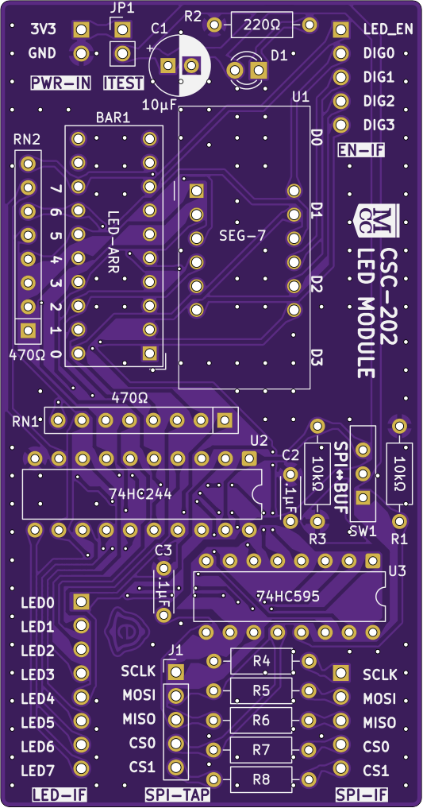

# CSC-202 LP-MSPM0G3507 Breakouts — Hardware Documentation

This site hosts the complete set of design, assembly, and fabrication artifacts generated from the KiCad projects via **KiBot**.

---

## ℹ️ Project
GitHub Repository: [ThunderSloth/mcc-csc202-lp-mspm0g3507-breakouts](https://github.com/ThunderSloth/mcc-csc202-lp-mspm0g3507-breakouts)

---

## 📁 Boards
### 2-Term Breakout

➡️ [Open page](2-term.md)

---

### 3-Term Breakout

➡️ [Open page](3-term.md)

---

### LED Display Module

➡️ [Open page](led-module.md)

---
